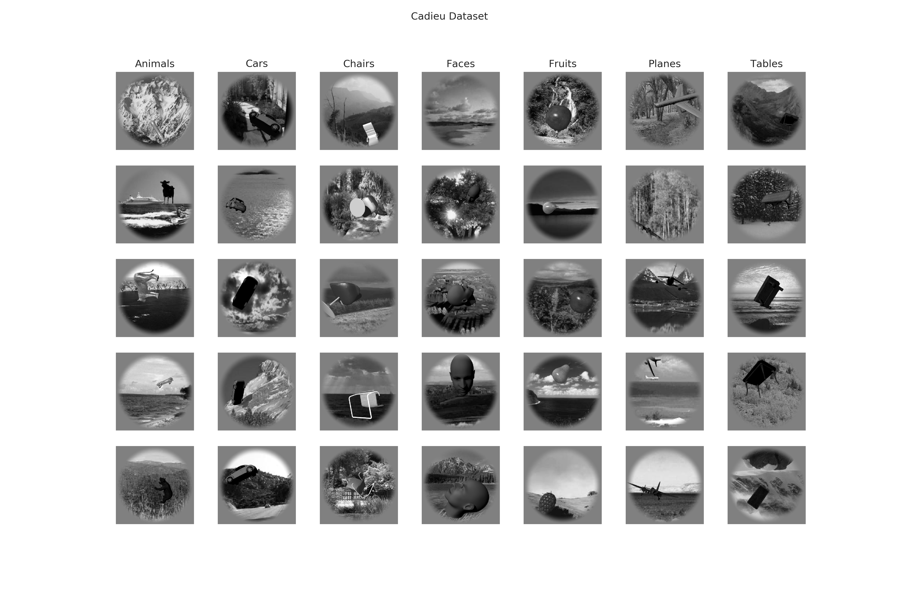
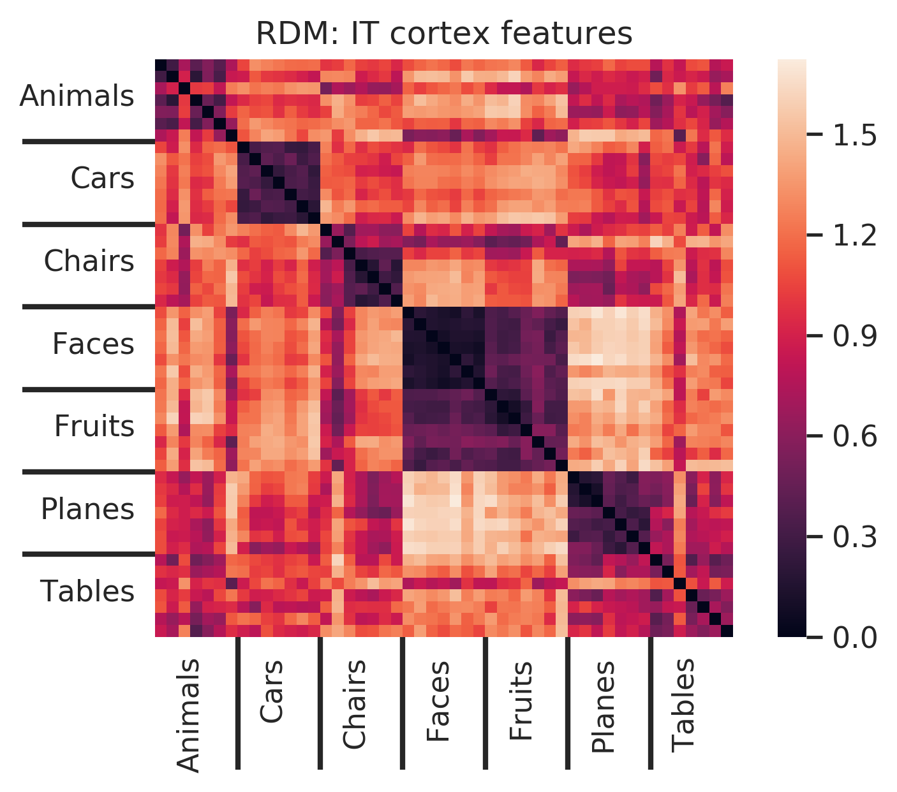

(**Status:** under active development. new code for testing rdm loss finetuning on CIFAR10, CIFAR100, SVHN datasets to be released soon)

## Finetuning Convolutional Neural Networks using Neural Activation Data

This work looks at ways of improving the existing Convolutional Neural Networks using neural activation data obtained from the Visual Cortex of [Macaques](https://en.wikipedia.org/wiki/Macaque) while being presented with correspoding image stimuli.

The analysis demonstrates the importance of inter-class/object representation variance, which becomes the motivation for introducing **RDM loss finetuning**, which can be used to improve the generalizing capability of shallow* (*not entirely correct usage*) CNN architectures. 

## Table of Contents
* [Cadieu Dataset](#cadieu-dataset)
* [Setup](#setup)
    * [System Configuration](#system-configuration)
    * [Environment Setup](#environment-setup)
    * [Instructions for getting started](#instructions-for-getting-started)
    * [Project Structure](#project-structure)
* [Similarity to IT Dissimilarity Matrix (SIT)](#similarity-to-it-dissimilarity-matrix-sit)
* [Linear SVM Analysis](#linear-svm-analysis)
* [Representational Dissimilarity Matrix (RDM) Visualization](#representational-dissimilarity-matrix-rdm-visualization)
* [RDM loss finetuning](#rdm-loss-finetuning)
<!-- * Appendix A: Noise matching of model features -->
<!-- * Appendix B: Linear SVM analysis -->
* [Bibliography](#bibliography)
* [Licence](#licence)


# Cadieu Dataset

The dataset consists of images belonging to 7 classes and 49 object types with a variety of background conditions and object positions. The seven class labels are:

1. Animals
2. Cars
3. Chairs
4. Faces
5. Fruits
6. Planes
7. Tables



The image paths are arranged in an order such that the images belonging to a particular object type are together. There are 40 images per object in the dataset, so images [1 - 40] belong to object 1, images [41 - 80] belong to object 2 and so on.

# Setup

## System Configuration
The project was built with the following configuration:

* Ubuntu 16.04
* CUDA 10.0
* CUDNN 7.4
* Python 3.7
* Pytorch 1.1

Though not tested, the project can still be expected to work out of the box for most reasonably deviant configurations.

## Environment Setup

* Create separate virtual environment for the project using the provided `environment.yml` file
```
conda env create -f environment.yml
conda activate cv
```

## Instructions for getting started!

1. Clone the repository (if you haven't already!)
```bash
git clone https://github.com/1jsingh/neural-finetuning.git
cd neural-finetuning
```
       
2. Download the Cadieu Dataset and place it in the `data` folder
  ```
  mkdir data && cd data
  wget https://s3.amazonaws.com/cadieu-etal-ploscb2014/PLoSCB2014_data_20141216.zip
  unzip PLoSCB2014_data_20141216.zip
  ```

3. Covert the matlab data files into organized python pickle format
    ```
    python -m utils.convert_mat2pkl
    ```

4. Extract CNN model features for the cadieu dataset
    ```
    mkdir models && cd models
    mkdir model_features && cd ..
    python -m utils.get_model_features
    ```


## Project Structure
* `Input-Data-Visualization.ipynb`: notebook for visualizing Cadieu dataset
* `SIT-LSVM-analysis.ipynb`: compute SIT and LSVM scores for a model
* `RDM-Visualisation.ipynb`: make RDM plots for neural and CNN model features
* `RDM-finetune.ipynb`: RDM loss training using neural/deeper model features
* `RDM-finetune-batch.ipynb`: notebook for performing RDM loss training with the entire list of model features and log the results
* `models`
  - `model_features`: directory for storing extracted image features for the Cadieu dataset
* `utils`: utility package for various tasks

## Similarity to IT Dissimilarity Matrix (SIT)

* Use the following command to compute the SIT score for any model. For eg.
```
python -m utils.sit_score -n 'squeezenet_v0'
```

* **Alternatively**, you can also follow along the analysis interactively using  `SIT-LSVM-analysis.ipynb` notebook

Following is a table of SIT scores for the penultimate layer features from some popular CNN architectures on the Cadieu dataset:  

|  **Model** | **Top-1 error*** | **Top-5 error*** | **SIT_mean** | **SIT_std**|
| --- | --- | --- | --- | --- |
|  **AlexNet** | 43.45 | 20.91 | 0.5312 | 0.0369 |
|  **VGG-11** | 30.98 | 11.37 | 0.5604 | 0.0313 |
|  **VGG-13** | 30.07 | 10.75 | 0.54387 | 0.0326 |
|  **VGG-16** | 28.41 | 9.62 | 0.5357 | 0.031 |
|  **VGG-19** | 27.62 | 9.12 | 0.5242 | 0.0307 |
|  **VGG-11 with batch normalization** | 29.62 | 10.19 | 0.523 | 0.0282 |
|  **VGG-13 with batch normalization** | 28.45 | 9.63 | 0.5262 | 0.0309 |
|  **VGG-16 with batch normalization** | 26.63 | 8.5 | 0.4955 | 0.0307 |
|  **VGG-19 with batch normalization** | 25.76 | 8.15 | 0.4986 | 0.029 |
|  **ResNet-18** | 30.24 | 10.92 | 0.51599 | 0.028 |
|  **ResNet-34** | 26.7 | 8.58 | 0.4894 | 0.0297 |
|  **ResNet-50** | 23.85 | 7.13 | 0.4464 | 0.0302 |
|  **ResNet-101** | 22.63 | 6.44 | 0.457 | 0.0311 |
|  **ResNet-152** | 21.69 | 5.94 | 0.4794 | 0.0321 |
|  **SqueezeNet 1.0** | 41.9 | 19.58 | 0.503 | 0.0375 |
|  **SqueezeNet 1.1** | 41.81 | 19.38 | 0.545 | 0.03686 |
|  **Densenet-121** | 25.35 | 7.83 | 0.4777 | 0.0325 |
|  **Densenet-169** | 24 | 7 | 0.4838 | 0.0286 |
|  **Densenet-201** | 22.8 | 6.43 | 0.4572 | 0.0309 |
|  **Densenet-161** | 22.35 | 6.2 | 0.4841 | 0.0299 |

**The top-1 and top-5 error values are reported for the imagenet classification task*

## Linear SVM Analysis

* Use the following command to compute the Linear SVM accuracy for any model. For eg.
```
python -m utils.lsvm_score -n 'squeezenet_v0'
```

* **Alternatively**, you can also follow along the analysis interactively using  `SIT-LSVM-analysis.ipynb` notebook

Following is a table of Linear SVM accuracy scores for the penultimate layer features from some popular CNN architectures on the Cadieu dataset:

|  **Features** | **lsvm_acc_mean (%)** | **lsvm_acc_std (%)** |
| :--- | :---: | :---: |
|  **IT-multi** | 65.43 | 1.66 |
|  **V4-multi**(128)** | 31.87 | 1.70 |
|  **AlexNet** | 54.51 | 2.21 |
|  **VGG-11** | 71.92 | 2.34 |
|  **VGG-13** | 73.56 | 2.18 |
|  **VGG-16** | 74.43 | 2.33 |
|  **VGG-19** | 74.84 | 1.90 |
|  **VGG-11 with batch normalization** | 74.60 | 2.02 |
|  **VGG-13 with batch normalization** | 75.88 | 1.90 |
|  **VGG-16 with batch normalization** | 78.05 | 1.92 |
|  **VGG-19 with batch normalization** | 77.39 | 2.41 |
|  **ResNet-18** | 72.04 | 2.30 |
|  **ResNet-34** | 71.85 | 2.34 |
|  **ResNet-50** | 74.01 | 2.07 |
|  **ResNet-101** | 73.05 | 1.97 |
|  **ResNet-152** | 77.94 | 1.99 |
|  **SqueezeNet 1.0** | 62.76 | 2.49 |
|  **SqueezeNet 1.1** | 63.97 | 2.50 |
|  **Densenet-121** | 64.80 | 2.80 |
|  **Densenet-169** | 63.65 | 3.13 |
|  **Densenet-201** | 64.04 | 3.60 |
|  **Densenet-161** | 64.98 | 3.21 |

## Representational Dissimilarity Matrix (RDM) Visualization

**Note: models with better SIT and Linear SVM scores have higher average representational dissimilarity between different object types**

* ***IT Cortex*** Features  
 

* RDM plots for ***models pretrained on Imagenet***  


## RDM loss finetuning

* Finetuning one of the existing shallow CNN architectures (eg. Squeezenet_v0) to mimic the representational dissimilarities found in neural/ deeper model features was found to improve the linear SVM accuracy score for the model features, i.e. an increase in SIT/ similarity score lead to an increase in the model's capability to generalize to the dataset distribution.

* Refer to the analysis in `RDM-finetune-batch.ipynb`  or `RDM-finetune-batch.ipynb` notebook for more details.

For instance, the following table reports the increase in linear SVM accuracy scores after finetuning the Squeezenet 1.0 model, using the ***RDM loss function alone*** with different CNN/IT cortex features: 

|  **Features** | **LSVM Accuracy ▲ (%)** |
| :--- | :---: |
|  **IT-multi** | **1.61** |
|  **AlexNet** | **-0.88** |
|  **VGG-11** | **7.69** |
|  **VGG-13** | **4.33** |
|  **VGG-16** | **6.57** |
|  **VGG-19** | **6.33** |
|  **VGG-11 with batch normalization** | **4.55** |
|  **VGG-13 with batch normalization** | **5.96** |
|  **VGG-16 with batch normalization** | **6.92** |
|  **VGG-19 with batch normalization** | **9.86** |
|  **ResNet-18** | **7.49** |
|  **ResNet-34** | **3.82** |
|  **ResNet-50** | **5.76** |
|  **ResNet-101** | **2.14** |
|  **ResNet-152** | **4.98** |
|  **SqueezeNet 1.0** | **-** |
|  **SqueezeNet 1.1** | **1.47** |
|  **Densenet-121** | **3.55** |
|  **Densenet-169** | **1.55** |
|  **Densenet-201** | **3.73** |
|  **Densenet-161** | **1.9** |

# Bibliography
**Please refer to the upcoming paper for a complete list of references**

1. <cite>Cadieu, Charles F., et al. "Deep neural networks rival the representation of primate IT cortex for core visual object recognition." PLoS computational biology 10.12 (2014): e1003963.</cite>


# Licence
The ideas and code presented in this repo are under the sole ownership of the author.  
*The Licence will be modified to a MIT licence, upon successful publication of the work.*
